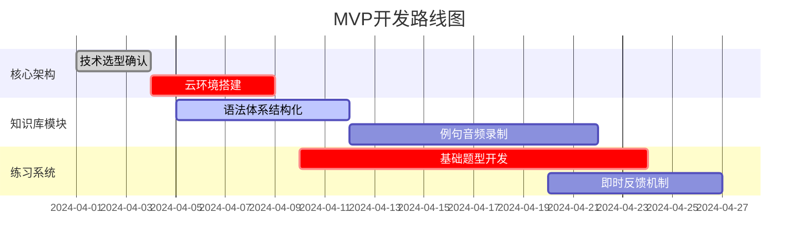

# 德语语法小程序开发任务拆解

## 第一阶段：MVP开发（6周）

### 功能模块优先级
| 模块 | 子任务 | 负责人 | 工时 |
|------|--------|--------|------|
| 前端框架 | Taro多端适配 | 前端组 | 40h |
| 数据层 | 云数据库设计 | 后端组 | 24h |
| 内容生产 | A1语法知识录入 | 内容组 | 80h |

## 第二阶段：功能迭代（8周）
### 关键里程碑
1. 错题本算法开发（Week 3）
2. 智能搜索接口联调（Week 5）
3. 会员系统压力测试（Week 7）

## 第三阶段：生态建设（12周）
### 跨部门协作
- 市场部：提前4周启动预热宣传
- 客服部：搭建FAQ知识库
- 设计部：制作运营素材包

## 风险管理
| 风险类型 | 应对方案 | 触发条件 |
|----------|----------|----------|
| 内容产能不足 | 启用外包协作 | 周产出＜20个语法点 |
| 云费用超支 | 启用CDN缓存 | 带宽＞50Mbps |
| 用户增长慢 | 启动裂变方案 | DAU＜1000持续1周 |

版本记录：
- v0.1 2024-03-28 初版