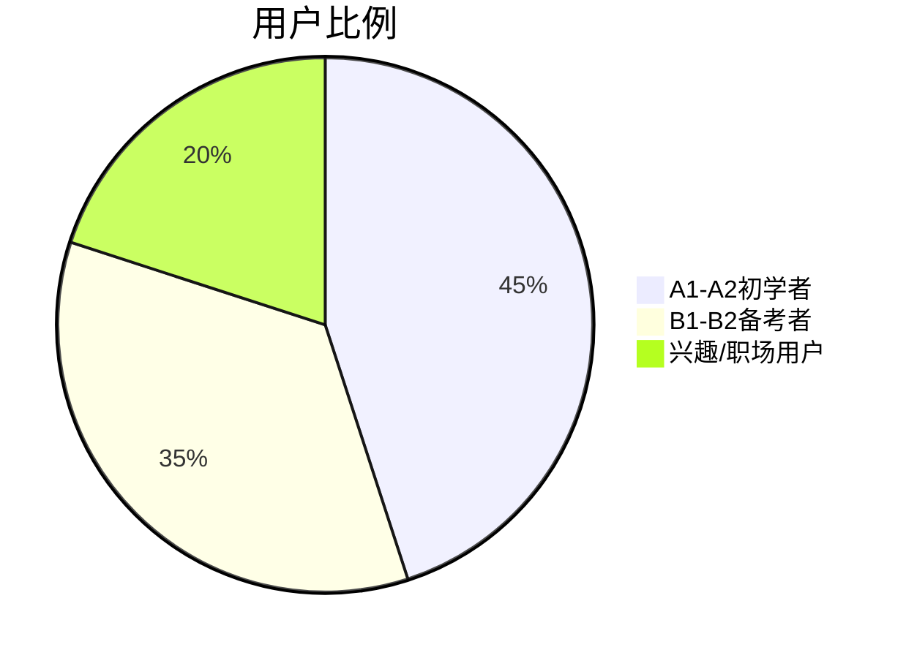
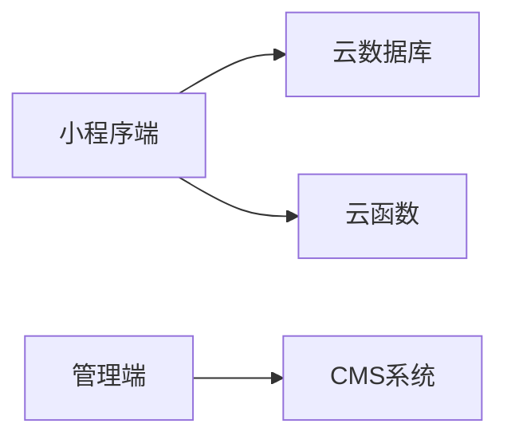

# 德语语法小程序需求文档

## 1. 项目概述
### 1.1 产品定位
- 核心定位：德语语法随身手册+智能练习系统
- 目标人群：A1-B2德语学习者、备考人群、在职提升者
- 核心价值：
  - 系统化语法知识体系
  - 智能化自适应练习
  - 便捷的语法速查功能

### 1.2 版本规划
| 版本阶段 | 核心功能 | 预计周期 |
|----------|----------|----------|
| MVP      | 基础语法库+练习系统 | 6周      |
| 1.0      | 错题本+搜索增强 | 8周      |
| 2.0      | 社区+高级功能 | 12周     |

## 2. 用户分析
### 2.1 用户画像


### 2.2 核心需求
| 用户类型 | 典型场景 | 功能需求 |
|----------|----------|----------|
| 初学者   | 建立语法框架 | 结构化知识库+基础练习 |
| 备考者   | 语法查漏补缺 | 错题本+专项练习 |
| 职场用户 | 快速查询 | 智能搜索+PDF导出 |

## 3. 功能需求
### 3.1 知识库模块
- 知识结构：
  ```
  A1
  ├── 名词
  │   ├── 性数格
  │   └── 冠词
  └── 动词
      ├── 现在时
      └── 可分动词
  ```

### 3.2 练习系统
- 题型设计：
  - 基础题（填空/选择）
  - 进阶题（排序/改错）
  - 专项练习（按语法点筛选）

## 4. 技术方案
### 4.1 系统架构


### 4.2 技术选型
| 模块       | 技术方案               |
|------------|------------------------|
| 前端       | Taro+ColorUI          |
| 后端       | 微信云开发            |
| 音频       | 七牛云存储+WebAudio   |
| 数据分析   | 微信云数据库+BI工具   |

## 5. 运营规划
### 5.1 推广策略
- 内容营销：知乎/B站语法专题
- 渠道合作：培训机构联合推广
- 裂变活动：打卡分享得会员

### 5.2 盈利模式
- 会员订阅（68元/季）
- 内容付费（专项课程）
- 广告收入（激励视频）

版本记录：
- v0.1 2024-03-20 初稿
- v0.2 2024-03-25 架构确认